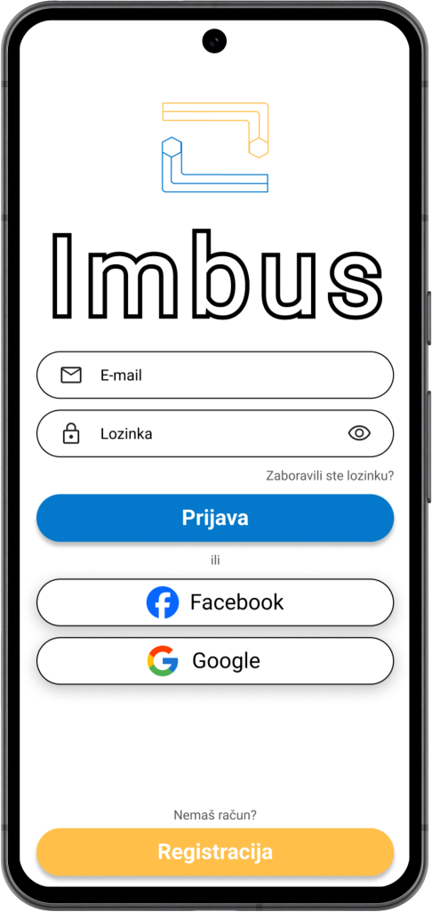

# Imbus

    

# Što je Imbus?

Imbus je mobilna aplikacija koja omogućuje korisnicima da pronađu majstore unutar Hrvatske, a razvijena je kao dio TVZ Mc2 natjecanja.

    

# Kod

Backend :
- Spring Boot
- Java 17
- Maven
- MySQL & Docker

Frontend:
- React Native
- Typescript
- Expo framework

# Funkcionalnosti i značajke

Korisnik kreira oglas na koji znalac daje ponudu. Unutar chata se dogovaraju oko datuma obavljanja posla koji se nakon potvrde automatski sprema u kalendar.

Najvažnije funkcionalnosti u našem kodu su:
- Kreiranje oglasa
- Pregledavanje i filtriranje oglasa
- Sitni kvarovi
- Chat
- Kalendar
- Filtriranje znalaca po kategoriji i lokaciji
- Recenzije
- Ponude
- Uređivanje profila

# Povratne informacije

Za povratne informacije slobodno nam se obratite na: kontakt {at} imbus.app

# Zapratite nas!

Facebook: [Imbus](https://web.facebook.com/profile.php?id=61559428845944)\
Instagram: [@imbus.app](https://www.instagram.com/imbus.app/)\
TikTok: [@imbusapp](https://tiktok.com/@imbusapp)\
YouTube: [Imbus](https://www.youtube.com/channel/UCjQ2bPtZzMhlNQ8rSvgls-Q)

# Tim

Aplikaciju su razvili članovi tima Blitz, studenti Tehničkog veleučilišta u Zagrebu:\
Zvonimir Škegro (dizajn)\
Oliver Živčić (programiranje)\
Leo Stričak (programiranje)