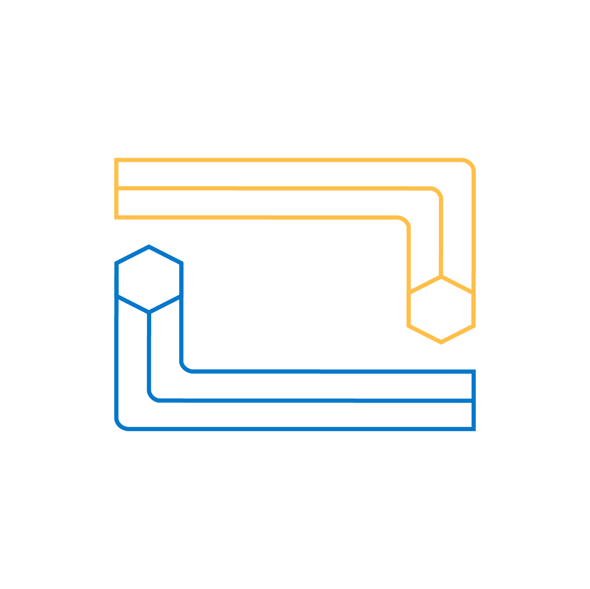
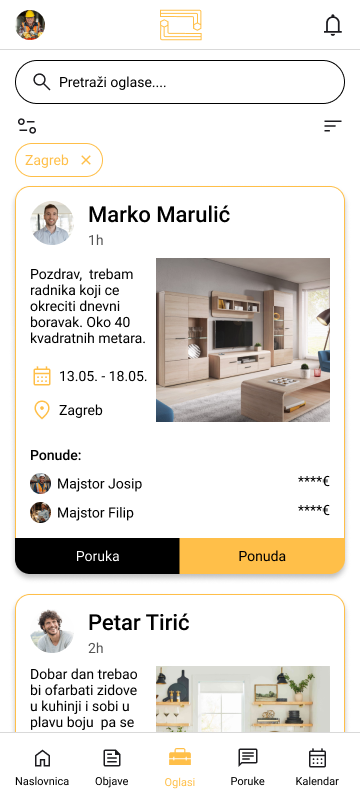
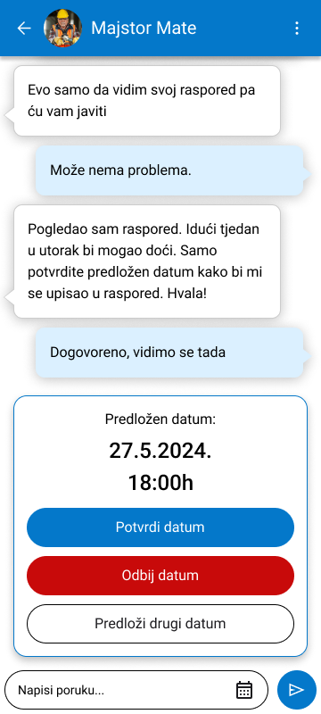
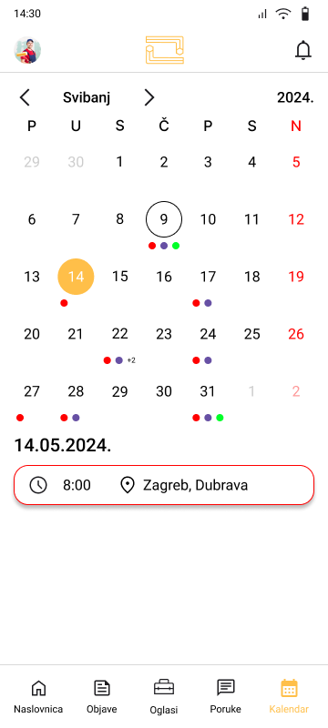

# Imbus

    

# Što je Imbus?

Imbus je mobilna aplikacija koja omogućuje korisnicima da pronađu majstore unutar Hrvatske, a razvijena je kao dio TVZ Mc2 natjecanja.

    

# Kod

Backend programiramo u Spring Bootu, u Javi verziji 17 (Maven). Frontend je isprogramiran u
React Nativeu s Expo frameworkom. Za bazu podataka koristimo MySQL koji je
konfiguriran s pomoću Dockera.

    

# Funkcionalnosti i značajke

Glavna funkcionalnost aplikacije je da korisnik može objaviti oglas i majstor može dati ponudu.

Najvažnije značajke u našem kodu su:
- Autentifikacija
- Autorizacija
- Mogućnost pregledavanja i filtriranje oglasa
- Exception handler
- Chat
- Kalendar
- Objave za sitne kvarove
- Mogućnost pretraživanja znalaca po filteru kategorije i lokacije
- Backend i frontend validacija
- Ponude
- Uređivanje profila
- Baza podataka

    
    

# Povratne informacije

Za povratne informacije slobodno nam se obratite na: kontakt {at} imbus.app

# Zapratite nas!

Facebook: [Imbus](https://web.facebook.com/profile.php?id=61559428845944)\
Instagram: [@imbus.app](https://www.instagram.com/imbus.app/)\
TikTok: [@imbusapp](https://tiktok.com/@imbusapp)\
YouTube: [Imbus](https://www.youtube.com/channel/UCjQ2bPtZzMhlNQ8rSvgls-Q)

# Tim

Aplikaciju su razvili članovi tima Blitz, studenti Tehničkog veleučilišta u Zagrebu:\
Zvonimir Škegro (dizajn)\
Oliver Živčić (programiranje)\
Leo Stričak (programiranje)